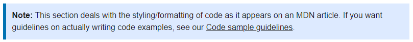
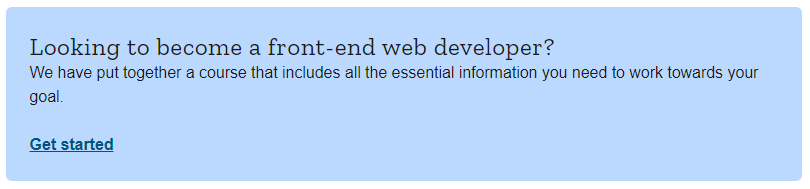

# Guide to localization particularities: mdn/translated-content

A guide/checklist for myself (and any interested [mdn/translated-content](https://github.com/mdn/translated-content) contributors) for localization differences in MDN Web Docs' translated content. Primarily created based on/for the [l10n-fr (French) locale](https://github.com/mdn/translated-content/tree/main/files/fr).

When it comes to differences in content between the English page and its translated counterparts, **always** consider the **English version** to be "correct"/up-to-date.

*Note: This guide was **not** created by any member of MDN. It contains observations and tips gathered by myself from various PRs and read-throughs of mdn/translated-content's French documentation. If reviewers suggest, request or push changes, it's a good idea to keep those in mind for future contributions to avoid repeating the same mistakes.*

## Links: Good places to start

Links to important GitHub repos and shortcuts to key documents/webpages:

- GitHub repo containing all translated MDN content: [mdn/translated-content](https://github.com/mdn/translated-content)
  - README, Contributing to translated-content: [README.md in mdn/translated-content](https://github.com/mdn/translated-content/blob/main/README.md)
  - [translated-content issues](https://github.com/mdn/translated-content/issues)
- Localizing MDN (+ contact the locale teams): [Active locales](https://developer.mozilla.org/en-US/docs/MDN/Contribute/Localize)
- GitHub repo containing the content behind MDN Web Docs (en-US original version): [mdn/content](https://github.com/mdn/content)
- The content repo README, which has information on fundamental concepts, PR etiquette and common actions: [README.md in mdn/content](https://github.com/mdn/content/blob/main/README.md)
- MDN's how-to guides: [Contributing to MDN, how-tos](https://developer.mozilla.org/en-US/docs/MDN/Contribute/Howto)
- What's Deployed for translated-content (see if your merged PR has been deployed to the site): [translated-content — What's Deployed](https://whatsdeployed.io/s/16d/mdn/translated-content)

## Types of contributions

Maintaining translated versions of MDN Web Docs can be quite difficult — the English docs are almost constantly changing and evolving, which can make it difficult to keep the translated versions up-to-date. Here are some types of contributions to consider if you're not sure where to start or what to do:

- Typo and formatting fixes
- Fixing links (dead, unneeded external, https, etc.)
- Fixing issues with images (not displaying, wrong source, etc.)
- Fixing issues with macros *(more detail on this in [Using macros](#using_macros))*
  - Fixing issues with live code examples
- Translating sections mistakenly left in English (fixing/correcting missed translations)
- Updating/synchronizing translated docs with the en-US versions
- General "clean-up" *(typically includes most/all of the above)*
- Fixing actionable issues through pull requests
- Creating issues to notify teams and contributors of problems found on translated pages ***(please be as clear and as detailed as possible in your issue titles and descriptions)***
- Translating a document from English into another language ***(refer to the list of [active locales](https://github.com/mdn/translated-content#locales))***

## Similarities: en-US and translations

Here is a quick list of what's kept the same or what's similar between `content` and `translated-content`, including small additions for files in the latter repo:

- **Newline at end of file:** at the end of every file in MDN Web Docs, whether it's en-US or any locale, should have a newline. This is considered an **MDN standard** (please also read the note directly below).
  - **Note: it's important to realize that when viewing a file on the regular GitHub UI (without expressly clicking to edit the file or viewing file changes in a PR/commit), this final newline is *not* shown.**
- **title:** the `title:` declaration is always at the very top of each file in both en-US and localized versions. Page titles can and should be translated *(with the exception of official coding terms and syntax such as HTML elements/tags, CSS properties, JavaScript functions, etc.)*.
- **slug:** also found at the top of every file, the slug essentially specifies part of a page's link. **Note that slugs are *not* to be translated!**
- **translation_of:** provide the slug of the en-US counterpart here. Unique to the `translated-content` repo, though `translation_of` often has the same slug as `slug`. *Note: it seems that this declaration is no longer necessary/used, but this has yet to be confirmed.*
- **Formal definition:** the `{{CSSinfo}}` macro *(also seen as `{{cssinfo}}`, though case doesn't necessarily matter)* is used universally; however, the placement of the `Formal definition` section/block tends to vary with each locale. Refer to other pages in the locale to which you're contributing to see where to place this. For HTML files, these macros are typically wrapped in `<div>` (sometimes `<p>`) tags.
- **Formal syntax:** the `{{csssyntax}` macro is used universally; however, the placement of the `Formal syntax` section/block tends to vary with each locale. Refer to other pages in the locale to which you're contributing to see where to place this. For HTML files, these macros are typically wrapped in `<div>` (sometimes `<p>`) tags.
- **Specifications:** specs in `translated-content` are and should be translated from en-US counterparts. For HTML files, specifications macros are typically wrapped in `<div>` (sometimes `<p>`) tags.
- **Compatibility tables:** translated pages use the same compatibility tables (or macro, depending on the page) as their en-US counterparts, though the content of these tables are translated to the corresponding language. For HTML files, compatibility table macros are typically wrapped in `<div>` (sometimes `<p>`) tags.
  - **browser-compat:** only necessary for pages with compatibility tables where the `{{Compat}}` macro takes no arguments — the same `browser-compat` value is used in en-US and localized versions. This declaration is placed below `translation_of` in `translated-content` files.
- **Sidebars:** translated pages use the same sidebar macros as their en-US counterparts. For HTML files, sidebar macros are typically wrapped in `<div>` (sometimes `<p>`) tags.
- **Menus/Navigation:** menu macros such as `{{NextMenu}}` and `{{PreviousMenuNext}}` should take the same arguments as their en-US counterparts.
- **Various compatibility and deprecation warnings:** macros like `{{SeeCompatTable}}` (notifies users that a technology is experimental), `{{optional_inline}}` (inline symbol that lets users know that something, often a function argument or CSS rule parameter, is optional), and `{{Deprecated_Inline}}` (inline icon that lets user know something has been deprecated), etc. should match their usage in en-US files. In other words, there shouldn't be a `{{SeeCompatTable}}` warning in a Chinese file if it's not in its English counterpart, and if the English version has a `{{Deprecated_Header}}` (similar to its inline version, but it's displayed as a card-style warning), the Chinese (or any locale/translated) counterpart should have it as well.
- **Formatting and layout:** the translated docs should, in general, be formatted and laid out in the same way as the en-US versions — however, if you find mistakes (e.g. incorrect Markdown syntax), please correct them in the translated file(s), and feel free to submit a PR at the mdn/content repo to fix those errors at the source as well!

## Key localization differences

Below is a non-extensive list of important differences between `translated-content` and `content` document structures, based on tips from review teams and my observations. Certain "concepts", such as macros, require more in-depth explanations and are given a subsection to address their particularities.

- **Tags:** the translated docs do **not** use tags (teams and contributors are still in the process of removing them) — found at the top of en-US files and possibly translated files where they haven't yet been deleted.
  - Removing tags doesn't seem to be a priority, so no need to make a PR removing tags from all files — if you're editing a page in the translated-content repo that happens to have tags, please do remove them.
- **No-breaking spaces (mostly French-specific):** when using punctuation that requires spaces before and/or after alphabetic characters like guillemets (`«»`), colons (`:`), semi-colons (`;`), question and exclamation marks (`?` and `!`), use no-breaking spaces (HTML entity `&nbsp;`).
  - A seemingly good rule of thumb for this is that when you're in doubt of whether a non-breaking space is "required", use one.
  - For example, note the presence of a non-breaking space in the following sentence: `Travailler avec des formulaires peut s'avérer compliqué&nbsp;!` (*renders as:* Travailler avec des formulaires peut s'avérer compliqué&nbsp;!).
  - An example with guillemets: `des «&nbsp;gouttières&nbsp;»` (*renders as:* des «&nbsp;gouttières&nbsp;»).
- **Code blocks:** for the most part, code such as class/ID names and the inner HTML of tags can be translated. Comments can be translated as well; however, declarations of variables and functions are usually kept in English.
- **Translation differences:** keep in mind that it's often not possible to find direct translations — in those cases, translate in a way that "makes sense" in the language concerned, while preserving the key meaning/conveying the main message.
- **Cards in l10n:** see the [Cards](#cards) section for details on using cards (in English, these are `Note:`, `Callout:` and `Warning:`).
- **Images:** see the [Images](#images) section.
- **Links:** see the [Links](#links) section.
- **Macros:** see the [Using macros](#using_macros) section for details on vocabulary/xref macros (`htmlelement`, `cssxref`, etc.) and embed macros (`EmbedLiveSample`, `EmbedInteractiveSample`, etc.).

### Cards

In English, the three main types of cards can be added using the keywords **Note:**, **Callout:**, and **Warning:**. The translated content also uses these cards *(they should be placed in the same file/page locations with the matching card style)*, but with translated keywords — to see the card keywords used by each locale, see their corresponding localization JSON file at [mdn/yari/markdown/localizations](https://github.com/mdn/yari/tree/main/markdown/localizations). ***All contents of such cards can and should be translated!***

For example, a **Note:** card is styled as follows:



In the French locale, the keyword is the same. Depending on whether the file you're working on has an `.html` or `.md` extension, you'd type:

- `.html` (the file is still in HTML): Create a `<div>` and apply the `note` class to it, then wrap `<strong>` tags around the keyword. The colon after the keyword tends to be placed outside of the `<strong>` tags. See below for an example.

```html
<div class="note">
  <p><strong>Примечание</strong>: Here's a note card in HTML.</p>
  <p>
    <pre class="brush: html">&lt;p&gt;You can also add blocks of code in these cards!&lt;/p&gt;</pre>
  </p>
</div>
```

- `.md` (the file has been converted to Markdown): Type `> **Note :**` to use the card (notice the Markdown bold and blockquote formatting, as well as the space preceding the colon as per French grammar rules). The "syntax" for a French note card would essentially match that of a blockquote in Markdown:

> **Note :** Paragraphe de référence (placeholder text), paragraphe de référence, paragraphe de référence, paragraphe de référence, paragraphe de référence, paragraphe de référence, paragraphe de référence, paragraphe de référence, paragraphe de référence.
>
> ```html
> <p>You can also add blocks of code in these cards!</p>
> ```

Similarly, a callout card (**Callout:**) looks like the following:



Aside from the change in keyword *(Note > Callout)*, the "syntax" for this type of card is the same as a that of a **Note:**. Directly below is an example for a Markdown file in the French locale *(Note > Remarque)*:

> **Remarque :** Paragraphe de référence (placeholder text), paragraphe de référence, paragraphe de référence, paragraphe de référence, paragraphe de référence, paragraphe de référence, paragraphe de référence, paragraphe de référence, paragraphe de référence.
>
> ```html
> <p>You can also add blocks of code in these cards!</p>
> ```

The warning card (**Warning:**) follows the same rules as **Note:** and **Callout:**. *Also see [MDN's guidelines and writing style guide](https://developer.mozilla.org/en-US/docs/MDN/Guidelines/Writing_style_guide#text_formatting_and_styles) for more on styles and formatting.*

### Images

Like in the `content` repo, avoid using external links for images: instead, use relative sources by providing the file name of the image to be displayed. Ensure that the source you provide matches that of the image file in the en-US repo. **The `alt` attribute can and should be translated to the locale language.**

If you're using the **same image as the en-US counterpart** of a page, using the same relative source for the image (which is really just the image's file name) will suffice. ***Please also note the exception specified below.***

- For example, to link to the "flexbox-example1.png" image, you can simply write `` for Markdown, or for HTML, give the `` tag a `src` attribute of "flexbox-example1.png" (and ideally, an `alt` attribute as well) like this: ``.
  - If you see external links/sources such as `https://mdn.mozillademos.org/files/13406/flexbox-example1.png`, or even relative file paths like `/files/3739/flex_terms.png`, be sure to test out the relative source on your local copy to ensure you've found the correct image source! Often, the simplest way to do so is to use the same image source as the en-US file. *See [PR #3331](https://github.com/mdn/translated-content/pull/3331) for an example of fixing image sources.*
- ***Exception:*** for embed macros like `{{EmbedLiveSample}}` to function properly, a copy of all images used in those live samples must be present in the same folder as the translated repo's `index.html` or `index.md` file. ***(Note: [a PR waiting on triage and merging at mdn/yari](https://github.com/mdn/yari/pull/5215) could remove this exception, but at the moment, no "solution" for this has been implemented.)***
  - *For example, the [French page on CSS `<blend-mode>`](https://developer.mozilla.org/fr/docs/Web/CSS/blend-mode) has multiple `{{EmbedLiveSample}}`s that rely on two image files, `br.png` and `tr.png`. Without these two image files in the `blend-mode` folder, the samples won't display properly — this was fixed in [PR #3383](https://github.com/mdn/translated-content/pull/3383).*

However, note that **if a locale is using an image that's different from the one included in en-US files, the image file will need to be uploaded to the same folder as the `index.md` or `index.html` file**.

### Links

The guidelines for relative and external links are very similar — concerns surrounding links in MDN's translated documentation primarily stem from the quality or existence of a page/resource in a certain language.

#### Relative links

For links within MDN Web Docs itself, simply provide the **slug in English** with `/<your-locale>/docs/` as a "prefix" *(if the full HTTP header is provided for a relative link, or if a non-canonical/non-English slug is used, Yari's flaw checker will detect this)*. If the linked page has been translated for your locale, link to the corresponding translated version. If not, you can link to the en-US page or do the same as before — in the latter case, Yari will detect a "broken link" and have it fallback on the en-US version, adding a "(en-US)" note after the link. For example:

- To link to the French *"Démarrer avec CSS"* page *("Getting started with CSS" in en-US)*, the following slug should be provided as the link source: `/fr/docs/Learn/CSS/First_steps/Getting_started`

If you're linking to a section header, chances are you won't be able to keep the English header ID/name — simply provide the ID or name that matches whichever section you're linking to. *This may vary with certain locales, particularly with zh-TW, which keeps their header IDs in English.*

- For example, to link to the *"Ajouter une classe" ("Adding a class" in en-US)* section/header of the French *"Démarrer avec CSS"* page, one would use the following slug: `/fr/docs/Learn/CSS/First_steps/Getting_started#ajouter_une_classe`
  - **Note:** to link to a section/header on the same page, just use the section ID. To be more precise — using the same example as above, if you're editing the *"Démarrer avec CSS"* page and want to link to the *"Ajouter une classe"* section at some point, just use this as the link source: `#ajouter_une_classe`

#### External links

Links should match those in the en-US counterpart, even if it leads to a page that is only available in English. Ensure that `https:` is used in external links *(the flaw-checker will warn of `http:` usage otherwise)*.

On a similar note, if the linked resource has a translation available for the language of your locale, you may include a link to the resource in that language provided that:

- It is of good quality, and its content matches/is up-to-date with the original (usually English) version;
- It is "well-maintained" and often updated (if applicable).

### Using macros

Macros were "migrated" to Yari from MDN's previous Kuma system, and some have been or are on track to being deprecated (deleted). Certain macros are here to stay, namely `{{EmbedLiveSample}}` and other various live sample macros, but vocabulary macros are possibly expected to be removed in the future. One macro that is in the process of being "purged" from translated-content pages, since it was deleted, is the `{{page}}` transclusion macro (see [mdn/translated-content issues](https://github.com/mdn/translated-content/issues)).

See the [macros folder at mdn/yari](https://github.com/mdn/yari/tree/main/kumascript/macros) for a full list of macros used in MDN Web Docs.

#### Vocabulary macros

Depending on the locale, the reviewing team may continue using macros as the en-US files do, or they may prefer to replace these macros with their corresponding links. For instance, the French (fr) locale replaces all vocabulary macros and some others with links to prepare for their potential deletion. Some examples of these, as in vocabulary and wiki macros, are:

- `{{HTMLElement}}`
- `{{CSSxRef}}`
- `{{JSxRef}}`
- `{{Interwiki}}`
- `{{Glossary}}`
- `{{htmlattrxref}}`
- `{{HTTPStatus}}`
- `{{DOMxRef}}`

#### Live and interactive code samples

The most commonly used live sample macro is `{{EmbedLiveSample}}`, though there are also some others such as `{{EmbedGHLiveSample}}` and `{{EmbedInteractiveExample}}`. The first of these must always take at least one argument — the first or only argument in the English files is the section anchor/heading, but this sometimes causes rendering errors for translated-content, so on the translated-content side, we tend to leave an empty string as the argument instead (e.g. `{{EmbedLiveSample("")}}` or `{{EmbedLiveSample('')}}`). The remaining arguments, typically width and height, should usually be kept the same as en-US.

The other two live sample macros (`GHLiveSample` and `InteractiveExample`) should be exact "copies" of what's written/used in the en-US counterparts.

*This section covers best practices for including these embed macros, and not how they work. If you'd like more details on the latter, see [Live samples — The MDN project](https://developer.mozilla.org/en-US/docs/MDN/Structures/Live_samples).*
